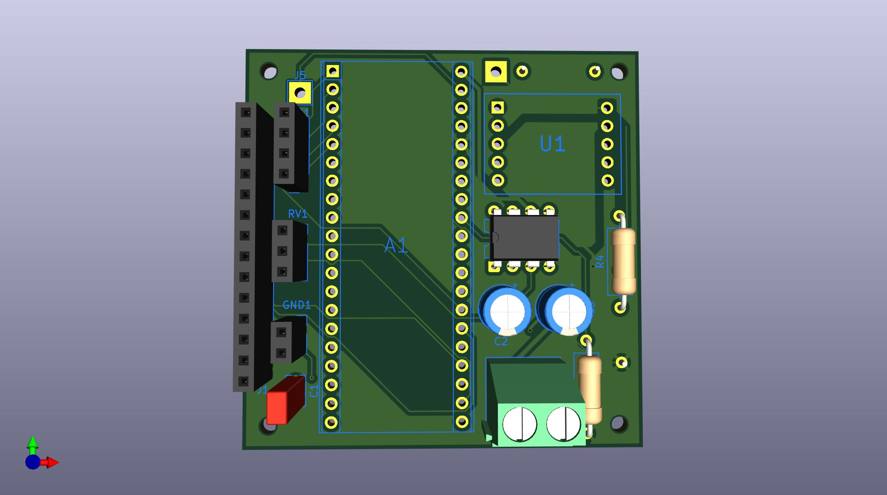

# ECE 299 Final Project – FM Clock Radio Prototype

This repository contains the full documentation, code, schematics, and PCB layouts for a custom FM Clock Radio designed as the final submission for the ECE 299 course at the University of Victoria.



---

## 📻 Overview

The FM Clock Radio combines an embedded microcontroller, a digital FM tuner, and a custom-designed PCB to create a functional prototype. The device is powered by a Raspberry Pi Pico running MicroPython, enabling station tuning, audio output, and modular interfacing.

The final product includes:

- FM radio functionality via I2C
- Custom PCB designed in KiCAD
- Schematic documentation
- 3D printable housing (prototype stage)
- Expandability for clock/alarm integration

---

## 📁 Repository Structure

```bash
.
├── .vscode/                        # VSCode workspace settings
├── .micropico/                    # MicroPython config for Pico
├── Clock-Radio/                   # Final PCB folder (KiCAD files)
├── Clock-Radio_Final_Submission.jpg  # Image of final PCB layout
├── Clock-Radio_Prototype.jpg      # Render of 3D enclosure/prototype
├── ECE299_SCHEMATIC.pdf           # Main schematic overview
├── fm_radio.py                    # MicroPython FM radio driver
├── fm_radio (1).py                # Backup or variant of the radio code
├── Radio.kicad_pro                # KiCAD project file
├── Radio.kicad_sch                # Main circuit schematic (KiCAD)
├── Radio.kicad_pcb                # Final PCB layout (KiCAD)
├── Radio_Schematic_1.pdf          # Amplifier or supporting circuits
├── Radio_schematic_2.pdf          # Additional subsystems
├── Sheet1.SchDoc                  # Altium schematic (legacy or alternate)
├── LICENSE                        # MIT License
└── README.md                      # This file
