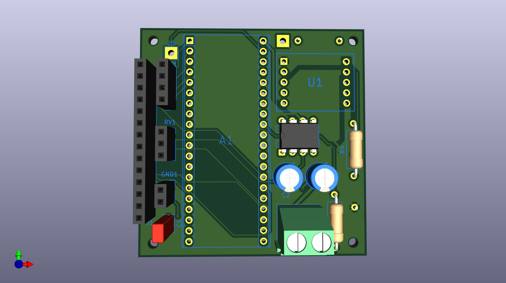

# ECE 299 Clock Radio Prototype

This repository contains the design files, source code, and schematics for an FM Clock Radio project developed for ECE 299 at the University of Victoria. The project showcases integration of radio frequency circuitry, 3D design, and embedded software to create a functional radio prototype.



---

## 📻 Project Overview

The Clock Radio prototype combines analog FM radio functionality with a microcontroller-based interface. Designed as part of a second-year engineering design course, the goal was to explore radio signal handling, PCB layout, and physical prototyping.

---

## 🧰 Contents

```bash
.
├── .vscode/                      # VS Code workspace settings
├── .micropico/                  # Project files related to MicroPython on Pico
├── Clock-Radio_Prototype.jpg    # Rendered 3D prototype image
├── fm_radio.py                  # MicroPython code to operate FM radio
├── fm_radio (1).py              # Backup or earlier version of radio code
├── Radio.kicad_pcb              # KiCAD PCB layout
├── Radio.kicad_sch              # KiCAD schematic
├── Radio.kicad_pro              # KiCAD project file
├── Radio_Schematic_1.pdf        # Printable circuit schematic (PDF)
├── Radio_schematic_2.pdf        # Secondary schematic or continuation
├── ECE299_SCHEMATIC.pdf         # Final or main schematic
├── Sheet1.SchDoc                # Altium schematic document (for reference)
├── LICENSE                      # Project license (MIT)
└── README.md                    # This file

